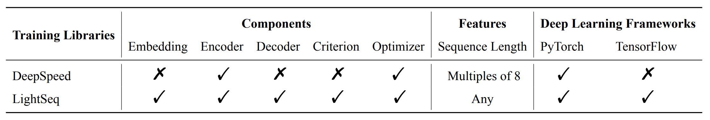
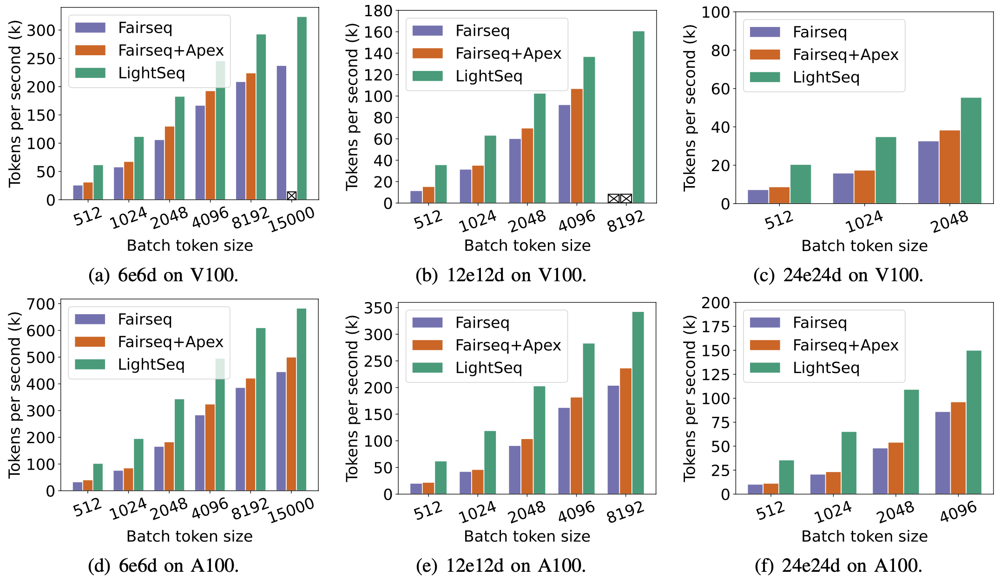

# LightSeq: A High Performance Library for Sequence Processing and Generation


**[2021/06/18]** :tada: :tada: :tada: **LightSeq supports fast training for models in the Transformer family now,
please check out [here](./lightseq/training/README.md) for details.**

---

LightSeq is a high performance training and inference library for sequence processing and generation implemented
in CUDA.
It enables highly efficient computation of modern NLP models such as **BERT**, **GPT**,
**Transformer**, etc.
It is therefore best useful for *Machine Translation*, *Text Generation*, *Dialog*, *Language
Modelling*, *Sentiment Analysis*, and other related tasks with sequence data.

The library is built on top of CUDA official
library([cuBLAS](https://docs.nvidia.com/cuda/cublas/index.html),
[Thrust](https://docs.nvidia.com/cuda/thrust/index.html), [CUB](http://nvlabs.github.io/cub/)) and
custom kernel functions which are specially fused and optimized for Transformer model family. In
addition to model components, the inference library also provide easy-to deploy model management and serving backend based on
[TensorRT Inference
Server](https://docs.nvidia.com/deeplearning/sdk/inference-server-archived/tensorrt_inference_server_120/tensorrt-inference-server-guide/docs/quickstart.html).
With LightSeq, one can easily develop modified Transformer architecture with little additional code.

## Features
### [>>> Training](./lightseq/training)
The following is a support matrix of LightSeq **training** library compared with
[DeepSpeed](https://github.com/microsoft/DeepSpeed).



### [>>> Inference](./lightseq/inference)
The following is a support matrix of LightSeq **inference** library compared with
[TurboTransformers](https://github.com/Tencent/TurboTransformers) and
[FasterTransformer](https://github.com/NVIDIA/DeepLearningExamples/tree/master/FasterTransformer).


## Performance

### [>>> Training](./lightseq/training)
Here we present the experimental results on WMT14 English to German translation task based on Transformer-big models. We train Transformer models of different sizes on eight NVIDIA Tesla V100/NVIDIA Ampere A100 GPUs with data parallel and fp16 mixed precision.
[Fairseq](https://github.com/pytorch/fairseq) with [Apex](https://github.com/NVIDIA/apex) is choosed as our baseline.



We compute speedup on different batch size using the WPS (real words per second) metric.

More results is available [here](./docs/training/performance.md)

### [>>> Inference](./lightseq/inference)
Here we present the experimental results on neural machine translation based on Transformer-base models using beam search methods.
We choose Tensorflow and
[FasterTransformer](https://github.com/NVIDIA/DeepLearningExamples/tree/master/FasterTransformer) as a comparison.
The implementation from
[tensor2tensor](https://github.com/tensorflow/tensor2tensor/blob/master/tensor2tensor/models/transformer.py)
was used as the benchmark of Tensorflow.


More results is available [here](./docs/inference/performance.md).


## Quick Start
### Fast training from Fairseq

You can experience lightning fast training by running following commands,
Firstly install these requirements.

```shell
pip install lightseq fairseq sacremoses
```

Then you can train a translation task on wmt14 en2de dataset by running the following script

```shell
sh examples/training/fairseq/ls_fairseq_wmt14en2de.sh
```

To compare lightseq with fairseq, delete the arguments with `ls_` prefix to using the original fairseq implementation

More usage is available [here](./lightseq/training/README.md).

### Fast inference from HuggingFace bart

We provide an end2end bart-base example to see how fast Lightseq is compared to HuggingFace. First you should install these requirements.

```shell
pip install torch tensorflow transformers lightseq
cd examples/inference/python
```

then you can check the performance by simply running following commands. `hf_bart_export.py` is used to transform pytorch weights to LightSeq protobuffer.

```shell
python hf_bart_export.py
python ls_bart.py
```

LightSeq installation from pypi only supports python 3.6 to 3.8 on Linux for now. Consider compiling from source if you have other environments.

More usage is available [here](./lightseq/inference/README.md).

## Cite Us

If you use LightSeq in your research, please cite the following paper.

```
@InProceedings{wang2021lightseq,
    title = "{L}ight{S}eq: A High Performance Inference Library for Transformers",
    author = "Wang, Xiaohui and Xiong, Ying and Wei, Yang and Wang, Mingxuan and Li, Lei",
    booktitle = "Proceedings of the 2021 Conference of the North American Chapter of the Association for Computational Linguistics: Human Language Technologies: Industry Papers (NAACL-HLT)",
    month = jun,
    year = "2021",
    publisher = "Association for Computational Linguistics",
    pages = "113--120",
}
```

## Contact

Any questions or suggestions, please feel free to contact us at
wangxiaohui.neo@bytedance.com, xiongying.taka@bytedance.com, qian.xian@bytedance.com, weiyang.god@bytedance.com, wangmingxuan.89@bytedance.com, lileilab@bytedance.com
