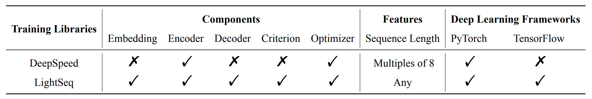
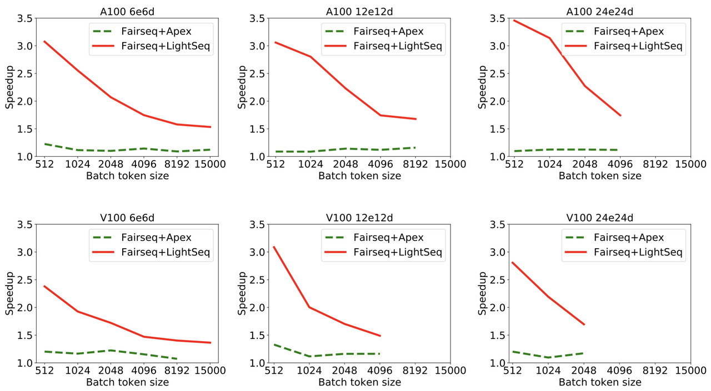

# Efficient Training Library for Transformer-based Models


[中文版本介绍](https://bytedance.feishu.cn/docs/doccn9w7UdOYcEOD99FjFVpdFzf)

LightSeq supports fast training for models in the Transformer family now!

We provide highly optimized custom operators for PyTorch and TensorFlow,
which cover the entire training process for Transformer-based models.
Users of LightSeq can use these operators to build their own models with efficient computation.

In addition, we integrate our custom operators into popular training libraries like
[Fairseq](https://github.com/pytorch/fairseq),
[Hugging Face](https://github.com/huggingface/transformers),
[NeurST](https://github.com/bytedance/neurst),
which enables a **1.5X-3X** end-to-end speedup campred to the native version.

With only a small amount of code, you can enjoy the excellent performance provided by LightSeq. Try it now!

## Features
- **High performance**.
In WMT14 English to German dataset, compared to [Fairseq](https://github.com/pytorch/fairseq) with [Apex](https://github.com/NVIDIA/apex),
LightSeq can provide **1.53** times speedup for transformer big model on NVIDIA Ampere A100 with 4096 batch size.
- **Comprehensive operators**.
LightSeq provides comprehensive efficient custom operators for PyTorch and TensorFlow, including embedding, encoder layer, decoder layer, criterion and optimizer. To the best of our knowledge, LightSeq is the first open source project that cover the entire training process for Transformer-based models.
In contrast, [DeepSpeed](https://github.com/microsoft/DeepSpeed) only provides encoder layer.
- **Simple and multi-level usage**.
In addition to directly using the custom layer in model code, users can also use LightSeq in popular training libraries without perception. For example, we register efficient versions of tasks and models in [Fairseq](https://github.com/pytorch/fairseq).
- **Rich secondary development tools**.
LightSeq provides complete unit tests and debug tools, which help users develop their own custom layer.

The following is a support matrix of LightSeq compared with
[DeepSpeed](https://github.com/microsoft/DeepSpeed).



## Performance
Detailed experimental results is available [here](./docs/performance.md). Here are the experimental results on WMT14 English to German task.

We train transformer models of different sizes on eight NVIDIA Tesla V100/NVIDIA Ampere A100 GPUs with data parallel and fp16 mixed precision.
[Fairseq](https://github.com/pytorch/fairseq) with [Apex](https://github.com/NVIDIA/apex) is choosed as our baseline.

### Speedup for single training step


We compute speedup on different batch size using the WPS (real words per second) metric.

### End-to-end wall-clock training time


## Code Structure
```shell
├── csrc # C source files
│   ├── kernels # CUDA kernels
│   ├── ops # CPP wrapper
│   ├── tensorflow
│   └── torch # pybind for PyTorch
├── docs
├── examples # examples of different codebases
│   ├── deepspeed
│   ├── fairseq
│   ├── huggingface
│   └── neurst
├── ops # python wrappers
│   ├── pytorch
│   │   ├── builder # kernel builders
│   │   ├── adam.py
│   │   ├── cross_entropy_layer.py
│   │   ├── transformer_decoder_layer.py
│   │   ├── transformer_embedding_layer.py
│   │   ├── transformer_encoder_layer.py
│   │   └── util.py
│   └── tensorflow
├── tests # unit test
│   ├── fairseq_layers.py # fairseq layers
│   ├── test_ls_kernels.py # test CUDA kernels
│   ├── test_ls_ops.py # test CUDA kernels
│   └── util.py # test LightSeq layers
└── README.md
```
## Requirements and Installation
### PyTorch
- PyTorch version >= 1.5.0
- Python version >= 3.6
- To install LightSeq training library:
```shell
git clone https://github.com/bytedance/lightseq.git
cd lightseq
pip install -e .
```

### TensorFlow
- Tensorflow version = 2.4
- Python version = 3.7
- Cuda version = 11.0
- To install LightSeq training library:
```shell
pip install http://sf3-ttcdn-tos.pstatp.com/obj/nlp-opensource/lightseq/tensorflow/lightseq_tf-2.0.1-cp37-cp37m-linux_x86_64.whl
```

## Usage

### Training libraries users.
LightSeq integrate its custom operators into popular training libraries. Users of these libraries can use LightSeq without perception:
- [Fairseq](./examples/fairseq/README.md)
- [Hugging Face](./examples/huggingface/README.md)
- [DeepSpeed](./examples/deepspeed/README.md)
- [NeurST](./examples/neurst/README.md)

### Building models from scratch
You can also use LightSeq operators directly in your codes to build your own models. To simplify the use of individual operators, LightSeq designed a simple and self-contained interface.

For example, if you want to use the encoder layers, you first need to generate a config containing all the arguments of the models and training. Then you can initialize the LightSeq encoder layer using the config and integrate it into you models.

```
from lightseq.training.ops.pytorch.transformer_encoder_layer import LSTransformerEncoderLayer

config = LSTransformerEncoderLayer.get_config(
    max_batch_tokens=4096,
    max_seq_len=256,
    hidden_size=1024,
    intermediate_size=4096,
    nhead=16,
    attn_prob_dropout_ratio=0.1,
    activation_dropout_ratio=0.1,
    hidden_dropout_ratio=0.1,
    pre_layer_norm=True,
    fp16=True,
    local_rank=0,
)
enc_layer = LSTransformerEncoderLayer(config)
```
Currently, LightSeq supports the separate use of five operations: embedding, encoder layer, decoder layer, criterion and optimizer. You can checkout out the `lightseq/training/ops/pytorch` and `lightseq/training/ops/tensorflow` directory for detail.

## Limitations and Future Plans
* Training with 8 bit integers.


## Contact
Any questions or suggestions, please feel free to contact us.
wangxiaohui.neo@bytedance.com, xiongying.taka@bytedance.com, qian.xian@bytedance.com, weiyang.god@bytedance.com
