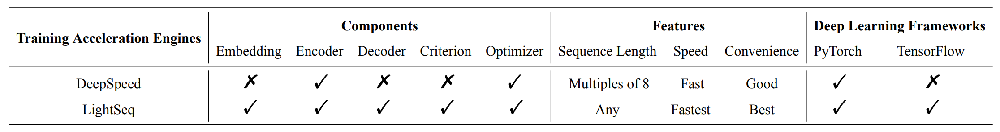
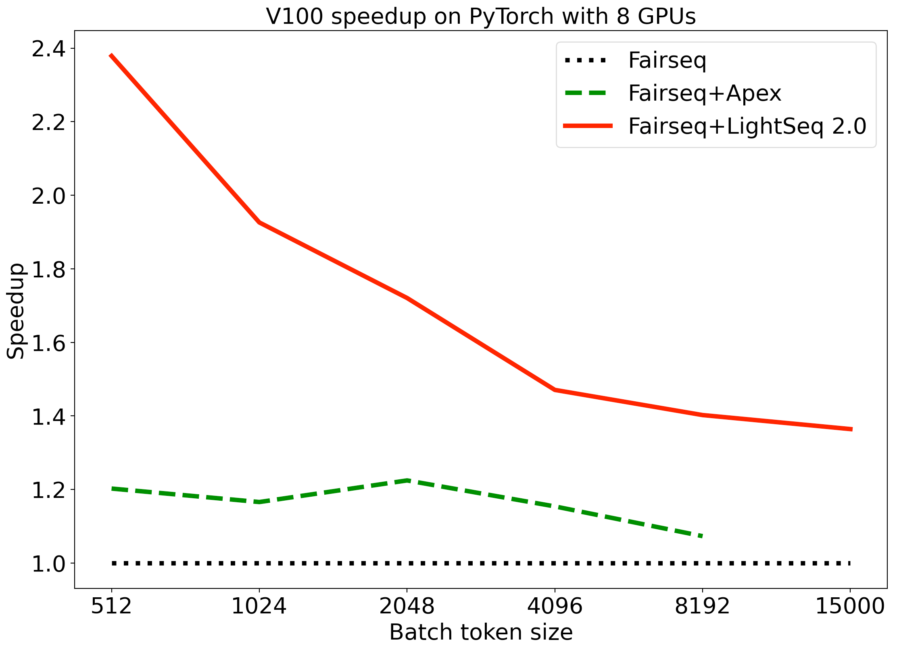
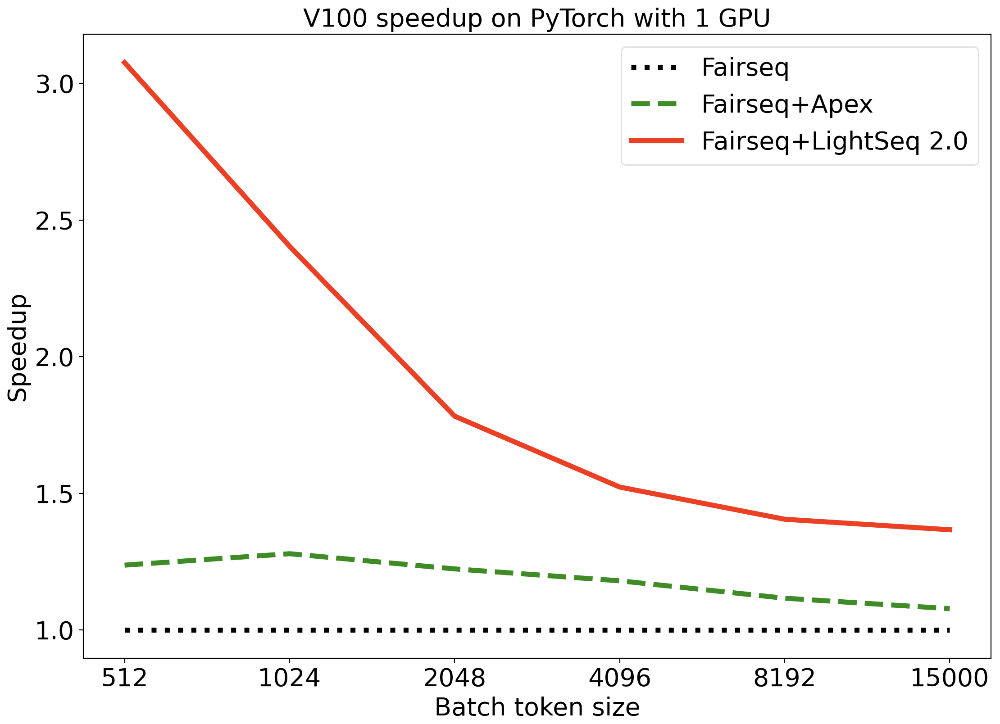

# LightSeq 2.0: An Efficient Training Acceleration Library for Transformers


[中文版本介绍](https://bytedance.feishu.cn/docs/doccn9w7UdOYcEOD99FjFVpdFzf)

LightSeq 2.0 is an efficient **training acceleration** library for Transformers implemented in CUDA.
It enables highly efficient computation of modern NLP models such as BERT, Transformer, etc.
It is therefore best useful for Machine Translation, Text Generation, Dialog, Language
Modelling, and other related tasks using these models.

The library is built on top of CUDA official
library ([cuBLAS](https://docs.nvidia.com/cuda/cublas/index.html), [CUB](http://nvlabs.github.io/cub/), etc.) and
custom kernel functions which are specially fused and optimized for these widely used models. In
addition to Transformer models, we also provide efficient embedding and criterion for most NLP models. We optimize the optimizers from [Apex](https://github.com/NVIDIA/apex) and further accerate the training process.

## Features
- **Fast training speed**.
In the standard machine translation task, LightSeq 2.0 has a single GPU and eight GPU acceleration ratio of 1.52 and 1.47 respectively with batch size 4096, compared with [Fairseq](https://github.com/pytorch/fairseq). In the case of batch size 512, the acceleration ratio is 3.08 and 2.38.
- **Complete Transformer acceleration**.
LightSeq 2.0 is the first training engine that fully supports the acceleration of the entire Transformer model, including embedding layer, encoder layer, decoder layer and criterion layer. In contrast, [DeepSpeed](https://github.com/microsoft/DeepSpeed) only supports acceleration of the encoder layer.
- **Rich unit tests**.
LightSeq 2.0 provides complete unit test functions of the CUDA kernels and custom Transformer layers, which can help developers test the correctness, analyze the running time and acceleration ratio easily.
- **Simple usage**.
LightSeq 2.0 can integrate into popular deep learning frameworks easily, such as PyTorch and TensorFlow. For example, you only need to add several startup parameters to start the training of Fairseq, without modifying any code. You can also flexibly replace individual model components (e.g. encoder layer) through two lines of code.

The following is a support matrix of LightSeq 2.0 compared with
[DeepSpeed](https://github.com/microsoft/DeepSpeed).



## Performance

Here, we show our main experimental results on neural machine translation (wmt14 en2de) with both PyTorch and TensorFlow.

Detailed results is available [here](./docs/performance.md).

### PyTorch
We use Fairseq as the codebase and compare the performance of different implementations.
- 8 GPUs


- 1 GPU


### TensorFlow
See [NeurST](https://github.com/bytedance/neurst) for more details.

## Code Structure
```shell
├── csrc # C source files
│   ├── kernels # CUDA kernels
│   ├── ops # CPP wrapper
│   ├── tensorflow
│   └── torch # pybind for PyTorch
├── docs
├── examples # examples of different codebases
│   ├── deepspeed
│   ├── fairseq
│   ├── huggingface
│   └── neurst
├── ops # python wrappers
│   ├── pytorch
│   │   ├── builder # kernel builders
│   │   ├── cross_entropy_layer.py
│   │   ├── transformer_config.py
│   │   ├── transformer_decoder_layer.py
│   │   ├── transformer_embedding_layer.py
│   │   └── transformer_encoder_layer.py
│   └── tensorflow
│
├── tests # unit test
│   ├── fairseq_layers.py # fairseq layers
│   ├── test_ls_kernels.py # test CUDA kernels
│   └── test_ls_ops.py # test lightseq layers
└── README.md
```

## Quick Start
### Run from Fairseq Script
We provide an end2end LightSeq 2.0 translation example to see how fast it is compared to Fairseq.

First you should install these requirements.
```shell
pip install torch ninja fairseq
git clone https://github.com/bytedance/lightseq.git
cd lightseq/training
```

Then you can check the performance by simply running following commands.
```shell
sh examples/fairseq/ls_fairseq_wmt14en2de.sh
```

### Run from Huggingface Script
We provide an end2end LightSeq 2.0 NER example to see how fast it is compared to Huggingface.

First you should install these requirements.
```shell
pip install torch ninja transformers seqeval
git clone https://github.com/bytedance/lightseq.git
cd lightseq/training
```

Then you can check the performance by simply running following commands.
```shell
sh examples/huggingface/run_ner.sh
```

### Integrate into Your Code
You can also integrate our Transformer models or layers into your code.

For example, if you want to replace the encoder layers in Fairseq with LightSeq encoder layers, you first need to define a config class containing all the arguments of the models and training. Then you can define the LightSeq encoder layer using the config and integrate it into you models.

```
from ops.pytorch.transformer_encoder_layer import LSTransformerEncoderLayer

config = LSTransformerEncoderLayer.get_config(*args)
enc_layer = LSTransformerEncoderLayer(config)
```

## Limitations and Future Plans
* Training with 8 bit integers.


## Contact
Any questions or suggestions, please feel free to contact us.
wangxiaohui.neo@bytedance.com, xiongying.taka@bytedance.com, qian.xian@bytedance.com, weiyang.god@bytedance.com
